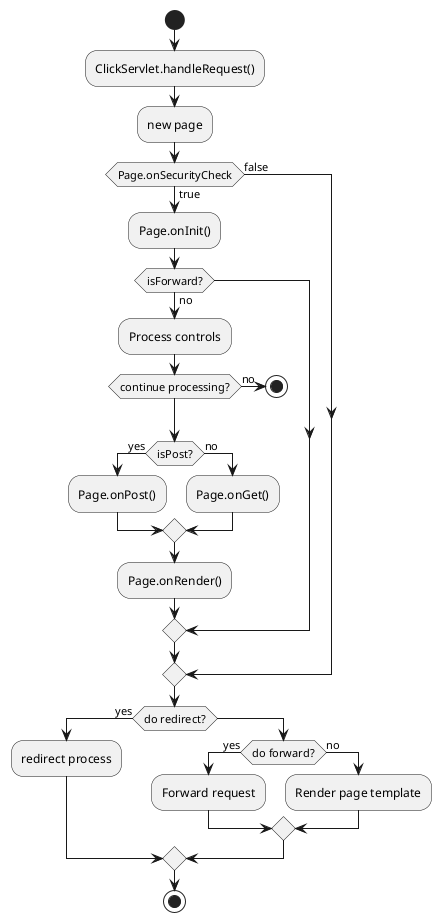

# plantuml demos
For more information, see the [PlantUML documentation](https://crashedmind.github.io/PlantUMLHitchhikersGuide).
## Example 1:

## Example 2:

## Example 3:

## Example 4:

## Example 5

## Example 6:

# Mermaid
For more information, see the [Mermaid documentation](https://mermaid-js.github.io/mermaid/#/).

To create a Mermaid diagram, add Mermaid syntax inside a fenced code block with the `mermaid` language identifier.

## Example 1:

Here is a simple flow chart:

## Example 2

    
    
